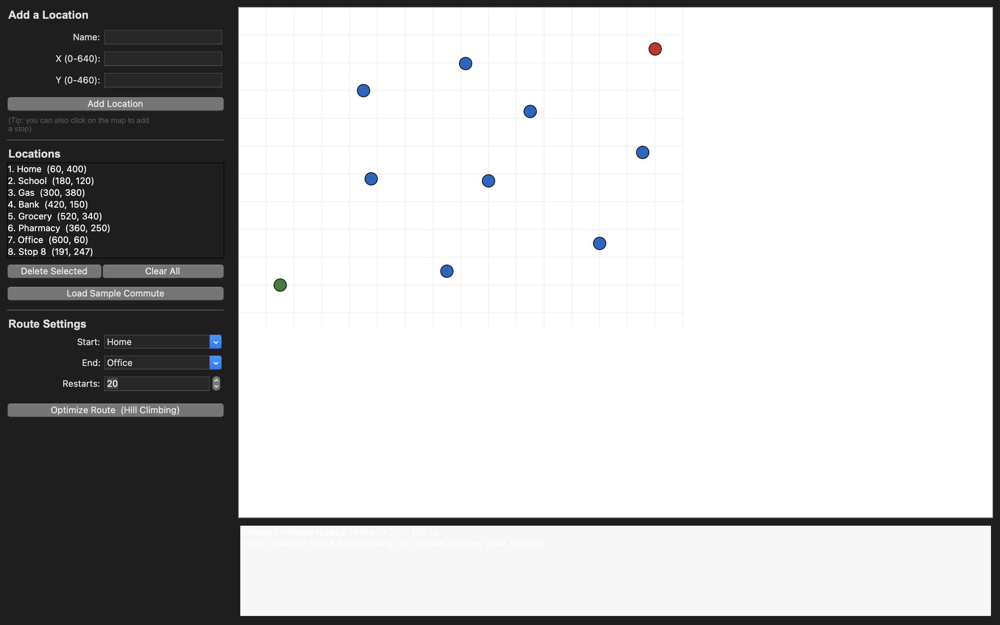
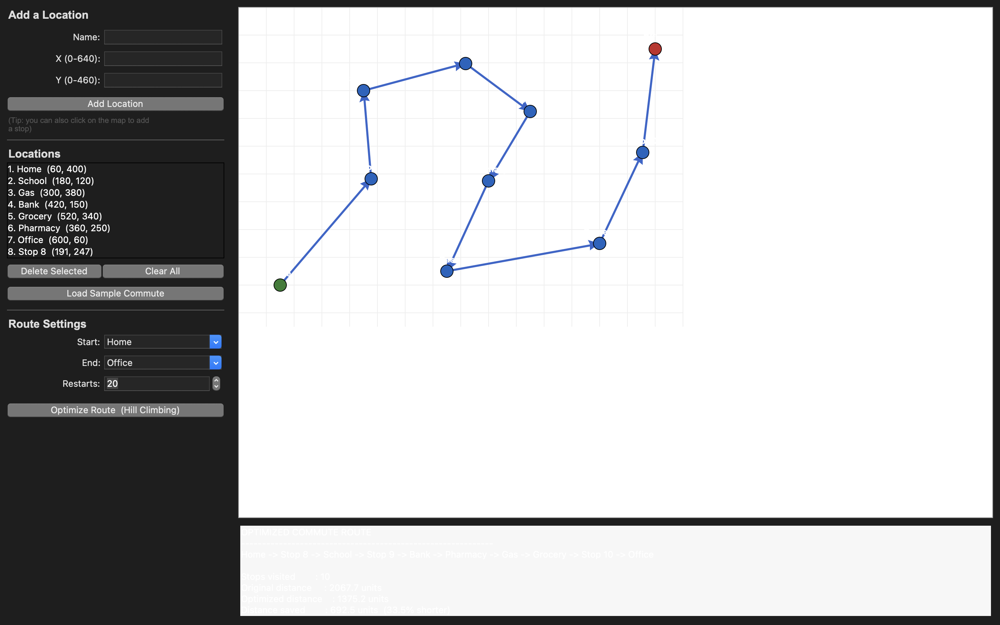

# Commute Route Optimizer

A Python desktop application that finds the shortest daily commute route using the **Hill Climbing** local-search algorithm, built with a **Tkinter** GUI.

- **Intern:** Waleed Ahmad Khan
- **Reg No:** Mtech-PY26017
- **Phase 1 Algorithm:** Hill Climbing
- **GUI Toolkit:** Tkinter

---

## What it does

A daily commuter starts from a fixed point (e.g. **Home**) and must reach a fixed destination (e.g. **Office**). Along the way they have to visit several stops — dropping children at school, refuelling the car, collecting groceries, visiting the bank, and so on.

The **order** in which these stops are visited changes the total distance travelled, and a bad order wastes time and fuel. This app takes a set of locations and automatically finds an ordering of the intermediate stops that gives the **shortest possible commute**, keeping the start and end points fixed.

The map is treated as a 2-D plane and distances are measured as straight-line (Euclidean) distances between locations.

## How the algorithm works

The project uses **Hill Climbing**, a local-search algorithm:

- A **state** is one complete ordering of the stops.
- A **neighbour** is the same ordering with any two stops swapped.
- The **cost** is the total distance of the whole route.

Hill Climbing repeatedly moves to a neighbouring route that lowers the total distance and stops when no single swap can improve it any further. **Random restarts** are added so the search begins from several different starting orders — this helps avoid getting stuck in a poor local optimum. The start and end locations always stay fixed; only the middle stops are reordered.

## Features

- Add locations by typing a name and coordinates, **or** by clicking directly on the map.
- Choose the start and end points from drop-down menus.
- Map canvas shows every location as a labelled dot — green for the start, red for the end, blue for the stops.
- Draws the optimised route with directional arrows once you optimise.
- Results panel shows the optimised order, the total distance, and how much shorter it is than the original order.
- "Load Sample Commute" button fills the app with a realistic example so it can be tested instantly.
- Input validation and edge-case handling (too few locations, identical start/end, non-numeric coordinates).

## Screenshots

**Main application window (sample commute loaded):**



**Optimised route with results:**



## Requirements

- **Python 3.8+**
- **Tkinter** (part of the Python standard library — no `pip install` needed for the app itself)

There are no external/third-party packages to install; the program only uses modules that ship with Python (`tkinter`, `math`, `random`).

> **Note for macOS (Homebrew Python):** Homebrew's Python does not include Tkinter by default. If you see `ModuleNotFoundError: No module named '_tkinter'`, install the matching Tk package, e.g.:
> ```bash
> brew install python-tk@3.14
> ```
> (replace `3.14` with your Python version). On Windows and most Linux distros Tkinter is already included; on Debian/Ubuntu you can install it with `sudo apt install python3-tk`.

## How to run

1. Clone this repository:
   ```bash
   git clone https://github.com/<your-username>/commute-route-optimizer.git
   cd commute-route-optimizer
   ```
2. Run the program:
   ```bash
   python commute_route_optimizer.py
   ```
   (use `python3` if that is how Python is invoked on your system)

The window opens preloaded with a sample commute. Press **"Optimize Route (Hill Climbing)"** to see the shortest order of stops.

## How to use

1. Use the sample data, or add your own locations (type a name + X/Y coordinates, or click on the map).
2. Pick the **Start** and **End** from the drop-down menus.
3. (Optional) Adjust the number of **Restarts**.
4. Click **Optimize Route (Hill Climbing)**.
5. Read the optimised order and total distance in the results panel; the route is drawn on the map.

## How I used AI

I used AI (Claude) as a learning and debugging aid — for example, to help me structure the Hill Climbing search, explain how random restarts reduce the chance of a poor local optimum, and troubleshoot a Tkinter setup issue on macOS. I reviewed, tested, and made sure I understood the logic myself; the design decisions and the final working code are my own.

## Project structure

```
commute-route-optimizer/
├── commute_route_optimizer.py   # main application (algorithm + Tkinter GUI)
├── README.md
├── screenshot1.png
└── screenshot2.png
```
